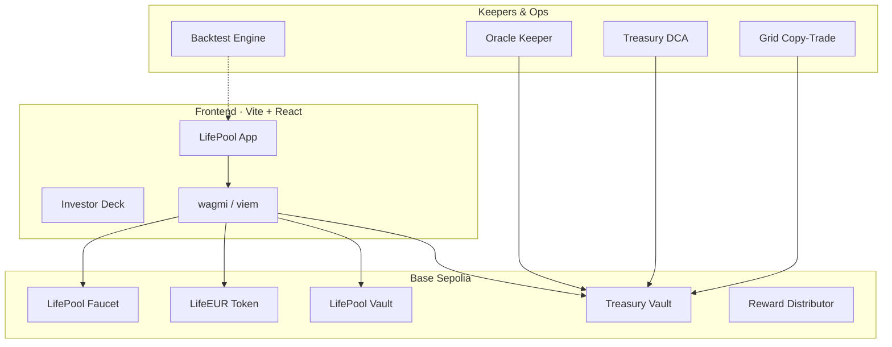

<div align="center">

# LifePool

**Mutual protection meets autonomous yield on Base.**

Cycle-locked pool membership · LIFEUR stablecoin · BTC/USDC grid agent · on-chain treasury — live on **Base Sepolia**.

<br />

[](https://lifepool-e17s.ipfs.4everland.app)
[](https://sepolia.basescan.org/address/0xF2a9Bea846D5a6b7b974146441CB06b3D3ba9dc2)
[](./contracts)
[]()

<br />

[**Open app**](https://lifepool-e17s.ipfs.4everland.app) · [**Investor deck**](https://lifepool-e17s.ipfs.4everland.app/deck/) · [**Treasury on Basescan**](https://sepolia.basescan.org/address/0xF2a9Bea846D5a6b7b974146441CB06b3D3ba9dc2)

</div>

---

## What is LifePool?

LifePool is a **mobile-first DeFi prototype** that combines:

- **Mutual pool** — members lock in for **4 years · 4 months · 4 days**, with on-chain membership and cycle tracking
- **LIFEUR** — euro-pegged stablecoin minted against collateral on Base Sepolia
- **Treasury** — USDC NAV + BTC grid sleeve, DCA and harvest keepers, verifiable on-chain
- **Grid agent** — BTC/USDC swing grid with copy-trade signals and backtested performance narrative

> Testnet prototype only. Not regulated insurance. Not mainnet funds.

---

## Live demo

| | Link |
|---|---|
| App | https://lifepool-e17s.ipfs.4everland.app |
| Investor deck | https://lifepool-e17s.ipfs.4everland.app/deck/ |
| Treasury | [0xF2a9…9dc2 on Basescan](https://sepolia.basescan.org/address/0xF2a9Bea846D5a6b7b974146441CB06b3D3ba9dc2) |

**Investor flow:** connect wallet → claim testnet funds → mint LIFEUR → join pool → explore dashboard, treasury, and grid copy-trade panel.

---

## Architecture



---

## Stack

| Layer | Tech |
|-------|------|
| Frontend | React 19, TypeScript, Tailwind CSS 4, Vite 8 |
| Web3 | wagmi 3, viem, TanStack Query |
| Contracts | Foundry, Solidity, Base Sepolia |
| Automation | TypeScript keepers, GitHub Actions |
| Hosting | 4EVERLAND IPFS, GitHub |

---

## Contracts (Base Sepolia)

| Contract | Address |
|----------|---------|
| TreasuryVault | [`0xF2a9…9dc2`](https://sepolia.basescan.org/address/0xF2a9Bea846D5a6b7b974146441CB06b3D3ba9dc2) |
| LifeEUR | [`0x4235…8b4d`](https://sepolia.basescan.org/address/0x42355c509743a92EBD6F2F7259D4f677Eca18b4d) |
| LifePoolVault | [`0x7DE2…0374`](https://sepolia.basescan.org/address/0x7DE24AB7CB9b2F88669aFDBDe38Af81bf0B00374) |
| LifePoolFaucet | [`0xDbb8…ce2E`](https://sepolia.basescan.org/address/0xDbb8dDcf2c9b03A1d64B2284C0Aa0971FBB7ce2E) |
| RewardDistributor | [`0x5f77…a101`](https://sepolia.basescan.org/address/0x5f774c73EbcD9cB9De4341E20C1810ad9E5aa101) |

Full manifest: [`deployments/base-sepolia.json`](./deployments/base-sepolia.json)

---

## Quick start

```bash
git clone https://github.com/Laszlo23/lifepool.git
cd lifepool
npm install
cp .env.example .env   # add your RPC + keys locally
npm run dev
```

Open http://localhost:5173

---

## Scripts

```bash
npm run dev              # local dev server
npm run build            # production build
npm run test             # lint + build + contracts + backtest + on-chain debug
npm run contracts:test   # Foundry unit tests
npm run backtest         # strategy backtest
npm run debug            # live health check vs Base Sepolia
npm run keeper:all       # run all keepers once
```

---

## Deploy on 4EVERLAND

| Setting | Value |
|---------|-------|
| Framework | Vite |
| Build command | `npm install && npm run build` |
| Output directory | `dist` |
| Node | **20+** (set `NODE_VERSION=20`) |

**Environment variables:**

```env
NODE_VERSION=20
VITE_CHAIN_ID=84532
VITE_BASE_SEPOLIA_RPC_URL=https://sepolia.base.org
VITE_APP_URL=https://lifepool-e17s.ipfs.4everland.app
VITE_B3OS_OPERATOR_ADDRESS=0xaaf620ee9e2a805323BF7363992E33e4412be3FB
```

See [docs/4EVERLAND.md](./docs/4EVERLAND.md) and [docs/INVESTOR_DEMO.md](./docs/INVESTOR_DEMO.md) for full deployment and demo guides.

---

## Project structure

```
lifepool/
├── src/                 # React app, hooks, strategy engine
├── contracts/           # Foundry smart contracts + tests
├── scripts/             # Keepers, backtest, debug flow
├── api/                 # Vercel serverless (Frame, ops) — optional
├── deployments/         # On-chain addresses per network
├── public/deck/         # Investor slide deck
└── docs/                # Launch & deployment guides
```

---

## Disclaimer

LifePool is a **Base Sepolia testnet demonstration**. It is not insurance, not investment advice, and not audited for mainnet use. Past backtest results do not guarantee future performance.

---

<div align="center">

Built on **Base** · Deployed on **4EVERLAND** · [github.com/Laszlo23/lifepool](https://github.com/Laszlo23/lifepool)

</div>
